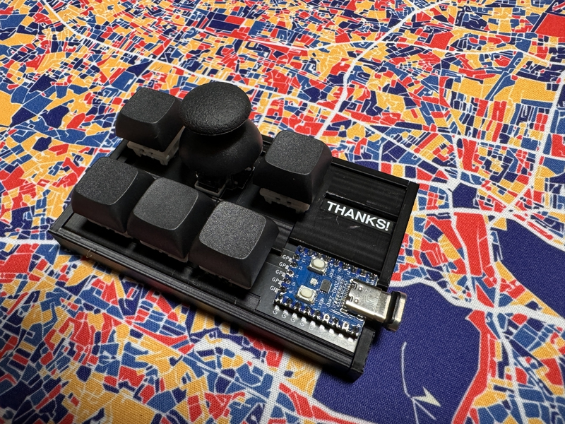

# coolpad29

## What is coolpad29?

coolpad29 is macro pad keyboard with joystick.
 

## firmware

https://github.com/telzo2000/coolpad29/tree/main/firmware/coolpad29

## buildguide

comming soon.

## patrs list

| No. | Patrs | Quantity | remarks | Suppliers | Cost |
|--|--|--|--|--|--|
|番号|名前|数|備考|調達先|参考価格（送料込）| 
|1|PCB|1||[elecrow](https://www.elecrow.com) [JLCPCB](https://jlcpcb.com) [ALLPCB](https://www.allpcb.com)|５枚で５ドル| 
|2|RP-2040Zero|1||[Talp Keyboard](https://talpkeyboard.net)|450円|
|3|Swith|5|cherry MX互換|[遊舎工房](https://yushakobo.jp) [Talp Keyboard](https://talpkeyboard.net) [Daily Craft Keyboard](https://shop.dailycraft.jp)等|1個で100円程度|
|4|Joystick|1|RKJXV122400R|[秋月電子](https://akizukidenshi.com/catalog/g/g115951/)|190円|
|5|CoverCase|2|3D Print|||

In addition, you will need a USB cable, keycaps, etc.
 
この他に、USBケーブル、キーキャップ等が必要です。
 